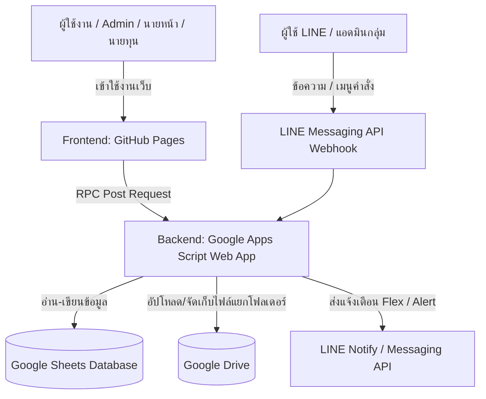

# APHITHANASAP (ระบบจัดการทรัพย์สินลงทุน)

ระบบบริหารจัดการทรัพย์สินการลงทุน อสังหาริมทรัพย์ ที่ดิน ขายฝาก-จำนอง ดอกเบี้ย และเอกสารสัญญา ครบวงจร เชื่อมต่อฐานข้อมูล Google Sheets, พื้นที่จัดเก็บ Google Drive, LINE Messaging API (Flex Messages) และหน้าบ้านผ่าน GitHub Pages

---

## 🏗 โครงสร้างสถาปัตยกรรมระบบ (Architecture)



### 1. Frontend (ส่วนหน้าบ้าน)
- **ไฟล์หลัก**: `index.html`
- **โฮสติ้ง**: [GitHub Pages](https://infinityrichglobal.github.io/APHITHANASAP/)
- **เทคโนโลยี**: HTML5, CSS3, JavaScript, Bootstrap 5, DataTables, FontAwesome, SweetAlert2
- **การเชื่อมต่อ**: ใช้ `google.script.run` Shim (Proxy Pattern) แปลงคำสั่งฟังก์ชันของ Apps Script ให้เป็นการยิง `fetch(POST)` ไปยัง Apps Script Web App อัตโนมัติ พร้อมระบบ Auto-retry กรณีสัญญาณหลุด

### 2. Backend (ส่วนประมวลผล)
- **ไฟล์หลัก**: `รหัส.js`, `appsscript.json`
- **ระบบ**: Google Apps Script (V8 Runtime)
- **Script ID**: `1sHARWM-M7IubWGCW2Ug2JGFPa7kPH7HQ3lTh_LZCx4EIBpSX10eIHbv0`
- **ฟังก์ชันสำคัญ**:
  - `doPost(e)`: เราเตอร์กลาง ตรวจจับแยกระหว่าง WebApp API Request กับ LINE Webhook
  - `handleWebApp(e)`: ระบบ RPC Whitelist Dispatcher ตรวจสอบสิทธิ์และเรียกฟังก์ชัน backend
  - `handleLineWebhook(e)`: จัดการคำสั่งจาก LINE Bot (`#admin`, `#status`, `#plots`, `#investor`, `#due`, `#expire`, `#overview`, `#manual`, `#id`) พร้อม Flex Message Carousels
  - การจัดการฐานข้อมูล, สิทธิ์ผู้ใช้งาน, คำนวณดอกเบี้ย, บันทึกการชำระเงิน และสร้างโฟลเดอร์ Google Drive สำหรับแต่ละแปลงทรัพย์สิน

### 3. Database & Storage
- **Google Sheets**:
  - `DATABASE`: ข้อมูลทรัพย์สินทั้งหมด (54 คอลัมน์)
  - `USERS`: บัญชีผู้ใช้และระดับสิทธิ์ (`admin`, `super_user1`, `user1` ฯลฯ)
  - `BROKERS`: ข้อมูลนายหน้า
  - `INVESTORS`: ข้อมูลนายทุน
  - `LINE`: การตั้งค่า LINE OA Token, Group ID, Master Admin, Alert Days
  - `DETAILS`: Dropdown Options สำหรับฟอร์ม
  - `LOGS`: Audit Log บันทึกประวัติการใช้งาน
- **Google Drive**: โฟลเดอร์ราก `FOLDER_ROOT` แยกโฟลเดอร์ย่อยตามแต่ละแปลง (โฉนด, สถานที่, สัญญา, วิดีโอ)

---

## 🛠 คำสั่งการใช้งาน Clasp & Git

โปรเจกต์นี้ผูกเข้ากับ **Google Clasp** เรียบร้อยแล้ว สามารถแก้ไขโค้ดจากคอมพิวเตอร์และซิงก์ได้ทันที

### การทำงานกับ Apps Script Backend (`รหัส.js`)
| คำสั่ง | คำอธิบาย |
|---|---|
| `npm run push` | อัปโหลดโค้ด (`รหัส.js`, `appsscript.json`) ขึ้นไปยัง Google Apps Script |
| `npm run pull` | ดึงโค้ดล่าสุดจาก Google Apps Script ลงมายังเครื่อง |
| `npm run status` | ตรวจสอบสถานะไฟล์ที่ติดตามโดย Clasp |
| `npm run deploy` | สร้าง Version และ Deploy Web App ใหม่ |
| `npm run deployments` | แสดงรายการ Deployments ทั้งหมด |
| `npm run open` | เปิดหน้า Apps Script Online Editor บนเบราว์เซอร์ |
| `npm run logs` | ดู Server Logs แบบ Real-time ผ่าน Stackdriver |

### การทำงานกับ Frontend (`index.html`)
เมื่อแก้ไขหน้าเว็บ `index.html`:
```bash
git add index.html
git commit -m "อัปเดตหน้าบ้าน"
git push origin main
```
เมื่อ Push ขึ้น GitHub เรียบร้อย GitHub Pages จะอัปเดตหน้าเว็บให้อัตโนมัติ

---

## 🔒 ความปลอดภัย (Security & Configuration)
- ไฟล์ `.clasprc.json` (ข้อมูลล็อกอิน Google) และ `node_modules` ถูกเพิ่มไว้ใน `.gitignore` เรียบร้อยแล้ว ห้าม Commit ขึ้น Git เด็ดขาด
- ไฟล์ `.claspignore` ถูกตั้งค่าให้ Clasp ติดตามเฉพาะไฟล์ Backend (`รหัส.js`, `appsscript.json`) ป้องกันการส่งไฟล์ `index.html` ขนาดใหญ่ขึ้นไปยัง Apps Script
